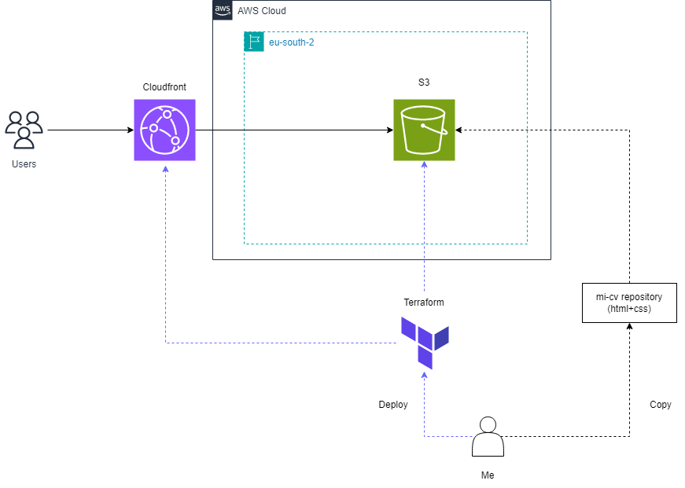

Aquí tienes el contenido completo para copiar y pegar:
markdown# cv-infra
Infraestructura como código (IaC) para desplegar mi currículum personal en AWS usando Terraform.

El currículum está disponible en: [pabloguirao/mi-cv](https://github.com/pabloguirao/mi-cv)

---

## Arquitectura



---

## Requisitos previos

| Herramienta | Versión | Instalación |
|---|---|---|
| Terraform | v1.14.7 | [HashiCorp docs](https://developer.hashicorp.com/terraform/install) |
| AWS CLI | v2.34.14 | [AWS docs](https://docs.aws.amazon.com/cli/latest/userguide/install-cliv2.html) |

### Configuración de credenciales AWS

Crear un usuario IAM en la consola de AWS con las siguientes políticas en línea:

- **S3**: CreateBucket, DeleteBucket, PutBucketPolicy, PutBucketWebsite, PutBucketPublicAccessBlock, PutObject, GetObject, DeleteObject, ListBucket
- **CloudFront**: CreateDistribution, GetDistribution, UpdateDistribution, DeleteDistribution, TagResource, CreateOriginAccessControl, GetOriginAccessControl, DeleteOriginAccessControl
- **IAM**: CreateServiceLinkedRole (limitado al rol de servicio de CloudFront)

Una vez creado el usuario, generar un **Access Key** y configurarlo en WSL:
```bash
aws configure
```

Introducir cuando lo solicite:
- AWS Access Key ID
- AWS Secret Access Key
- Default region: `eu-south-2`
- Default output format: `json`

Verificar que las credenciales funcionan correctamente:
```bash
aws sts get-caller-identity
```

---

## Estructura del proyecto
```
cv-infra/
├── main.tf          # Recursos principales (S3 + CloudFront)
├── variables.tf     # Variables reutilizables
├── outputs.tf       # Outputs de Terraform (URL, etc.)
├── providers.tf     # Configuración del proveedor AWS
└── README.md        # Este archivo
```

---

## Cómo desplegar

### 1. Inicializar Terraform
Descarga los providers necesarios:
```bash
terraform init
```

---

## Problemas conocidos y soluciones

**Permisos de escritura en WSL sobre discos de Windows**
Al trabajar con WSL sobre carpetas creadas con PowerShell como administrador,
WSL no tiene permisos de escritura. Solución: dar permisos al usuario desde
Propiedades → Seguridad → Control total en Windows.

---

## Autor

**Pablo Guirao**  
[github.com/pabloguirao](https://github.com/pabloguirao)